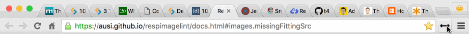

# Sbat :left_right_arrow:

Because sometimes you just want to reverse the order of your current tabs in Chrome.

Works on your currently active window and only reverses normal tabs - leaves pinned ones alone.

## Development

Clone this repo. Go to `chrome://extensions` in a tab in Chrome and click `Load unpacked extension`. Open the cloned directory and :tada:. When you make a change to the code, reload the extension from this page (Cmd + R).

As this doesn't use a HTML file it's a bit trickier to debug than an extension that does: instead of right-clicking on the extension icon and selecting `Inspect`, click the `Inspect Views: background page` option from the `chrome://extensions` page entry. To force it run with DevTools open, type `location.reload(true)` in DevTools console that pops up.

#### Credit

Icon made by <a href="http://www.flaticon.com/authors/dave-gandy" title="Dave Gandy">Dave Gandy</a> from <a href="http://www.flaticon.com" title="Flaticon">www.flaticon.com</a> is licensed by <a href="http://creativecommons.org/licenses/by/3.0/" title="Creative Commons BY 3.0" target="_blank">CC 3.0 BY</a>.
